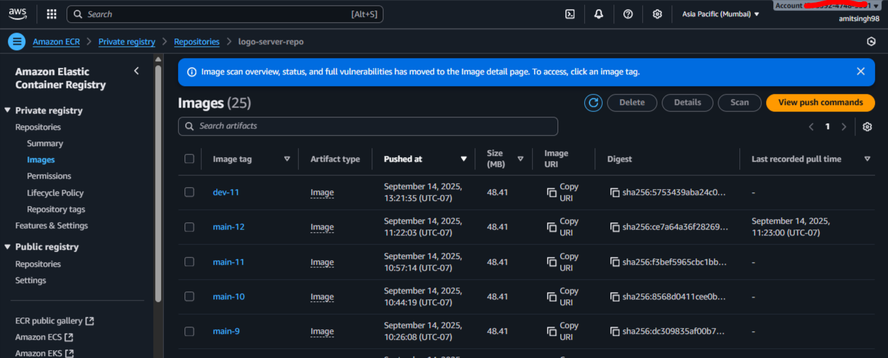
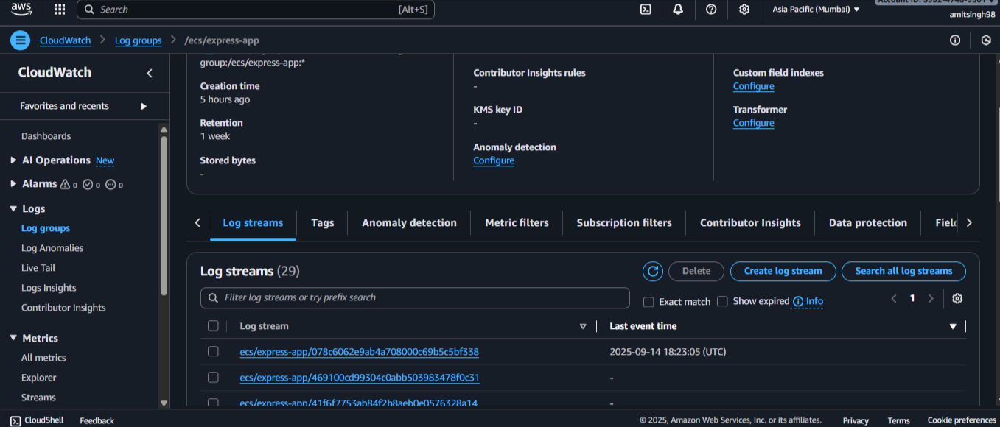

````markdown
````
# 🚀 Node.js App on AWS Fargate with CI/CD Pipeline
Note:
We are using a Multibranch Jenkins Pipeline with two branches:
**dev branch → Runs terraform plan only.* 
This helps us detect and fix any infrastructure errors safely before applying changes.
**main branch → Runs terraform apply.* 

Once a Pull Request (PR) from dev to main is merged, the pipeline automatically applies the changes.
This is triggered by a GitHub webhook (push event), ensuring that deployments to AWS Fargate are automated and consistent.

````
````
## 🧰 Getting Started

## 📌 Architecture Overview

The architecture includes:

- **Developer Workflow**
  - Code pushed to GitHub → Webhook triggers Jenkins
  - Multibranch pipeline (dev & main branches)

- **Jenkins Pipeline**
  - **dev branch** → Runs `terraform plan` only (for validation & testing infra changes)
    
  - **main branch** → Runs `terraform apply` (applies infra changes after PR merge)]
    

- **AWS Resources**
  - **ECR** – Store Docker images
  
  - **ECS Fargate** – Run containers without managing servers
   
     
  - **ALB (Application Load Balancer)** – Route traffic
  - **Terraform** – Manage Infrastructure as Code (IaC)
  - **IAM Roles** – Permissions for ECS tasks and execution

📊 **Architecture Diagram**  


---

## ⚙️ Setup Instructions

### 1️⃣ Prerequisites

- AWS Account with admin access
- AWS CLI installed & configured (`aws configure`)
- Terraform installed (>= v1.6)
- Docker installed & running
- Jenkins installed with:
  - Multibranch Pipeline Plugin
  - GitHub integration
  - AWS Credentials Plugin

---

### 2️⃣ Clone the Repository

```bash
git clone https://github.com/your-org/nodejs-fargate-app.git
cd nodejs-fargate-app
```

---

### 3️⃣ Configure AWS ECR

1. Create an ECR repo:
   ```bash
   aws ecr create-repository --repository-name logo-server-repo
   ```

2. Authenticate Docker with ECR:
   ```bash
   aws ecr get-login-password --region ap-south-1 | docker login --username AWS --password-stdin <account_id>.dkr.ecr.ap-south-1.amazonaws.com
   ```

---

### 4️⃣ Build & Push Docker Image

```bash
docker build -t logo-server-repo .
docker tag logo-server-repo:latest <account_id>.dkr.ecr.ap-south-1.amazonaws.com/logo-server-repo:latest
docker push <account_id>.dkr.ecr.ap-south-1.amazonaws.com/logo-server-repo:latest
```

---

### 5️⃣ Terraform Deployment

1. Initialize Terraform:
   ```bash
   terraform init
   ```

2. Validate Infra (dev branch):
   ```bash
   terraform plan
   ```

3. Apply Infra (main branch):
   ```bash
   terraform apply -auto-approve
   ```

Terraform provisions:
- ECS Cluster & Service (Fargate)
- Task Definition (with correct ECR image)
- ALB & Target Group
- IAM Roles for ECS execution

---

### 6️⃣ Jenkins Multibranch Pipeline Setup

1. Create a **Multibranch Pipeline** in Jenkins.
2. Connect repository via GitHub.
3. Add `Jenkinsfile` to repo:

```groovy
pipeline {
    agent any
    environment {
        AWS_ACCESS_KEY_ID     = credentials('aws-access-key-id')
        AWS_SECRET_ACCESS_KEY = credentials('aws-secret-access-key')
        AWS_DEFAULT_REGION    = 'ap-south-1'
    }
    stages {
        stage('Terraform Init') {
            steps {
                sh 'terraform init'
            }
        }
        stage('Terraform Plan') {
            when { branch 'dev' }
            steps {
                sh 'terraform plan'
            }
        }
        stage('Terraform Apply') {
            when { branch 'main' }
            steps {
                sh 'terraform apply -auto-approve'
            }
        }
    }
}
```

4. Configure **GitHub Webhook** for automatic builds.

---

## 🔄 CI/CD Pipeline Flow


1. **Developer pushes to dev branch** → Jenkins runs `terraform plan` (dry run).
2. **If plan is clean**, a Pull Request is created → reviewed & merged into main.
3. **Merge into main** → Jenkins runs `terraform apply` → infra + app deployed.
4. **ECS Service pulls image from ECR** → Runs container in Fargate.
---

## 🧹 Cleanup

To destroy resources:

```bash
terraform destroy -auto-approve
```

---

## 📂 Project Structure

```
├── app/                 # Node.js application
├── deployment-proof/    # Architecture & pipeline screenshots
├── Jenkinsfile          # CI/CD pipeline definition
├── main.tf              # Terraform configuration
├── variables.tf         # Terraform variables
├── outputs.tf           # Terraform outputs
└── README.md            # Deployment guide
```

---


## 🛠️ Tools & Services Used

* **GitHub** → Version control, branching (`main`, `dev`)
* **Jenkins** → CI/CD automation
* **Docker** → App containerization
* **Trivy** → Docker image vulnerability scanning
* **SonarQube** → Code quality and linting
* **AWS ECR** → Docker image registry
* **AWS ECS (Fargate)** → Serverless container orchestration
* **Terraform** → Infrastructure as Code (IaC)
* **AWS CloudWatch** → Logs and monitoring for ECS tasks



---

<pre lang="markdown"> 
## 📐 Architecture Diagram 
  ```
  flowchart TD 
  A[Developer Pushes Code] -->|GitHub Webhook| 
  B[Jenkins Pipeline] 
  B --> C[Build & Test: npm install + lint] 
  C --> D[Dockerize App] 
  D --> E[Trivy Security Scan] 
  E --> F[Push Image to AWS ECR] 
  F --> G[Terraform Apply (Main Branch)] 
  G --> H[AWS ECS Fargate Service] 
  H --> I[Deployed Node.js App] 
  H --> J[AWS CloudWatch Logs] ``` </pre>
  
## ⚡ Challenges Faced & Solutions
### Github Commits issue
* **Challenge**: Since I have many commits in my github repo, but I have built production ready structure with terraform and multibranch jenkins. If I had more time, I would have maintained the clean structure of commits


### ✅ Branch-specific Pipeline Behavior

* **Problem**: Different logic needed for `dev` vs `main` (e.g., Terraform only on `main`)
* **Solution**: Used Jenkins environment variables and `when` conditions to dynamically control pipeline logic.

---

### 🔐 ECR Authentication Issues

* **Problem**: Docker push to AWS ECR failed due to expired auth sessions.
* **Solution**: Used `aws ecr get-login-password` with `withAWS` Jenkins plugin credentials block.

---

### 🗂️ Terraform State Management

* **Problem**: Risk of branches overwriting each other's Terraform state.
* **Solution**: Remote S3 backend with DynamoDB locking. Used path-based isolation (`ecs/${branch}/terraform.tfstate`).

---

### 📄 Container Logs & Visibility

* **Problem**: Debugging ECS container issues was difficult.
* **Solution**: Configured CloudWatch log groups with retention and linked to ECS task definitions.

---

## 🚀 Possible Improvements

* **✅ Blue-Green / Canary Deployments**
  Safer zero-downtime deployment strategies.

* **✅ GitOps Workflow (ArgoCD / Flux)**
  Declarative deployments managed via Git, replacing Jenkins for delivery/deployment.

* **✅ Terraform Modules**
  Currently I have used only terraform single file for dev and main branch. But in jenkins I have seperated with the help of condition of triggers based on branch commits. We can break down infra code into reusable modules (VPC, ECS, IAM, etc.), or work with workspaces for better environment structure.

* **✅ Advanced Monitoring**
  Add CloudWatch custom metrics, alarms, Prometheus, Grafana integration.

* **✅ Secrets Management**
  Use AWS Secrets Manager or HashiCorp Vault instead of hardcoded values.

* **✅ Unit & Integration Tests**
  Enhance CI pipeline with automated test coverage reports.

---


